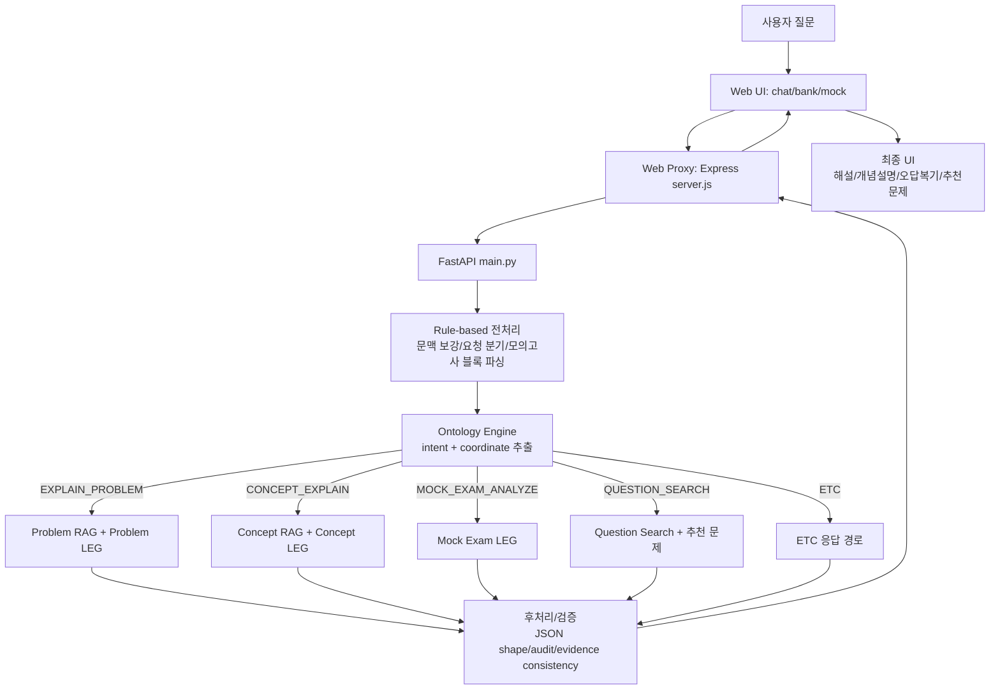

# Forge

Forge는 네트워크관리사 2급 학습을 위한 Ontology-guided RAG 기반 AI Tutor 프로젝트입니다.

이 저장소는 단일 앱이 아니라 다음을 포함하는 통합 워크스페이스입니다.

1. 사용자용 웹 서비스 (Next.js)
2. AI 백엔드 (FastAPI + RAG + 온톨로지)
3. 성능 비교 실험 파이프라인 (LLM-only, Naive RAG, Full Pipeline)
4. 데이터/온톨로지/벡터DB 자산

------------------------------------------------------------

## 1) 프로젝트 목표

핵심 목표는 아래 3가지입니다.

1. 사용자 질문을 과목/단원/개념 좌표로 해석
2. 좌표 기반으로 근거 문서를 정밀 검색
3. 정답 근거와 오답 소거 논리를 일관된 형식으로 설명

결과적으로, 정답률뿐 아니라 설명 품질(정확성/완결성/가독성)까지 계량 평가할 수 있도록 설계되어 있습니다.

### 1.1 이 프로젝트가 실제로 만든 것

Forge는 단순 챗봇이 아니라, "시험 문제 풀이 + 개념 설명 + 오답 복기"를 하나의 학습 루프로 연결한 AI 학습 시스템입니다.

사용자가 체감하는 결과물은 다음과 같습니다.

1. 문제 해설
- 정답 번호만 주는 것이 아니라, 왜 맞고 왜 틀리는지 보기별로 설명

2. 개념 학습
- 동일 주제를 개념형으로 재설명하고, 혼동 포인트와 암기 포인트까지 제공

3. 시험 모드
- 50문제 모의고사 생성/채점/과목별 통계/오답 분석/채팅 연계

4. 운영 관점 품질관리
- 단순 정답률뿐 아니라 근거충실도, 환각률, LLM Judge 점수까지 수치화

즉, 이 프로젝트는 "네트워크관리사 2급에 특화된 근거 기반 AI 튜터 서비스"를 완성하는 것을 목표로 구성되었습니다.

### 1.2 핵심 엔진 용어 정리 (Ontology / RAG / LEG / Rule-based)

아래는 Forge 파이프라인의 핵심 레이어입니다.

1. Ontology 분석
- 역할: 사용자 발화를 의도(intent) + 지식 좌표(subject/chapter/concept)로 구조화
- 구현: python_api/app/rag/ontology_engine.py
- 효과: "무엇을 설명해야 하는지"를 모호하지 않게 결정

2. RAG (Retrieval-Augmented Generation)
- 역할: 좌표/쿼리 기반으로 문서를 검색하고, 검색 문맥으로 해설 생성
- 구현: python_api/app/rag/engine.py, python_api/app/rag/chroma_store.py
- 효과: 환각을 줄이고 근거 기반 답변 비율을 높임

3. LEG (Learning Explanation Generator)
- 역할: 학습자 친화적인 해설 JSON 스키마를 강제하고, 설명 품질을 표준화
- 구현:
  - 문제 해설형 LEG: python_api/app/rag/problem_explain_leg.py
  - 개념 설명형 LEG: python_api/app/rag/concept_explain_leg.py
  - 모의고사 맥락 LEG: python_api/app/main.py (mock exam helper block)
- 효과: "정답 근거 + 오답 분석 + 인사이트 + 암기팁" 형태를 일관되게 출력

4. Rule-based 오케스트레이션
- 역할: 모든 요청을 LLM에 그대로 맡기지 않고, 규칙/패턴 기반 분기와 보정 수행
- 구현 예:
  - 후속문맥 보강: python_api/app/rag/conversation_context.py
  - 경로 분기/후처리: python_api/app/main.py
  - 모의고사 컨텍스트 블록 파싱/분기: python_api/app/main.py
- 효과: 맥락 누락, 잘못된 경로 진입, 포맷 붕괴를 줄이고 안정성 향상

5. REG 용어에 대해
- 현재 코드/문서 기준으로 "REG"라는 독립 엔진 명칭은 사용하지 않습니다.
- 보통 팀 내 대화에서 REG는 RAG 또는 생성(Generation) 단계를 지칭하는 약칭으로 혼용되는 경우가 있어, 이 README에서는 공식 용어를 Ontology -> RAG -> LEG -> Rule-based orchestration으로 통일합니다.

------------------------------------------------------------

## 2) 저장소 구성

```text
forge/
├── forge-web/                  # Next.js 웹 앱
│   ├── app/                    # 라우트 페이지 (home/chat/bank/mock/login/admin)
│   ├── components/             # 랜딩/공통 UI 컴포넌트
│   ├── styles/                 # 전역 스타일
│   ├── server.js               # Next + Express API 프록시 서버
│   └── nginx.forge.cortie.io   # Nginx 리버스 프록시 샘플
├── python_api/                 # FastAPI 백엔드
│   ├── app/main.py             # API 엔드포인트 집약
│   ├── app/rag/                # RAG/온톨로지 엔진
│   ├── requirements.txt        # Python 의존성
│   ├── run.sh                  # 개발 실행 스크립트
│   └── start.sh                # 운영 실행 스크립트(환경변수 포함)
├── performance_comparison/     # 실험/평가/요약 파이프라인
├── data/                       # 문제/이론 데이터
├── refs/structure/             # 온톨로지 구조 JSON
├── RAG/                        # 레거시/보조 RAG 자산
└── README.md
```

------------------------------------------------------------

## 3) 아키텍처 개요

### 3.1 런타임 컴포넌트

1. Web Frontend: Next.js 14
2. Web API Proxy: Express (Next 서버 내부)
3. AI API: FastAPI
4. LLM: Ollama (원격 서버 기본)
5. Embedding: Ollama bge-m3
6. Vector Store: ChromaDB

### 3.2 기본 모델/서버 설정

python_api 기준 기본값:

- OLLAMA_HOST: http://100.79.44.109:11434
- OLLAMA_MODEL: gemma4-e4b:latest
- OLLAMA_EMBED_MODEL: bge-m3:latest

### 3.3 요청 흐름

1. 브라우저가 웹 페이지에서 /api/* 호출
2. forge-web/server.js가 Python API로 프록시 전달
3. FastAPI가 Rule-based 전처리(문맥 보강/요청 분류/특수 블록 파싱) 수행
4. Ontology 엔진이 의도와 좌표를 결정
5. 경로별로 RAG + LEG(문제형/개념형/모의고사형) 실행
6. 결과 JSON을 후처리/검증 후 웹 응답으로 반환
7. 웹이 최종 메시지/카드/오답분석 UI로 렌더링

### 3.4 파이프라인 다이어그램



컴포넌트별 대표 파일:

1. Rule-based 오케스트레이션: python_api/app/main.py, python_api/app/rag/conversation_context.py
2. Ontology 분석: python_api/app/rag/ontology_engine.py
3. RAG 실행 엔진: python_api/app/rag/engine.py
4. LEG 템플릿/검증:
   - 문제형: python_api/app/rag/problem_explain_leg.py
   - 개념형: python_api/app/rag/concept_explain_leg.py
  - 모의고사형: python_api/app/main.py (mock exam helper block)

### 3.5 실서비스 동작 시나리오

아래는 실제 사용자 행동 기준으로 엔진이 어떻게 동작하는지 요약한 시나리오입니다.

시나리오 A: 문제 풀이 요청

1. 사용자가 문제+보기를 입력
2. Rule-based가 문제 형식인지 판별
3. Ontology가 EXPLAIN_PROBLEM + 좌표를 산출
4. RAG가 좌표 기반 근거 검색
5. Problem LEG가 보기별 분석/오답 교정/암기팁 생성
6. 후처리 검증 후 채팅 카드로 렌더링

시나리오 B: 개념 설명 요청

1. 사용자가 예: OSPF와 RIP 차이 질문
2. Ontology가 CONCEPT_EXPLAIN 좌표 결정
3. RAG가 관련 개념 문맥 검색
4. Concept LEG가 비교형 설명 생성
5. 사용자 요청(초보자 설명 등) 반영해 응답

시나리오 C: 모의고사 복기 요청

1. 사용자가 모의고사 제출
2. 서버가 점수/과목별 통계/오답 목록 생성
3. Mock Exam LEG가 취약 개념/빈출 패턴 분석
4. 채팅으로 넘겨 특정 오답 재해설 또는 유사문제 확장

------------------------------------------------------------

## 4) 웹(Frontend) 상세

### 4.1 기술 스택

- Next.js 14.2.3
- React 18
- TypeScript
- Express (프록시)

### 4.2 주요 페이지

1. / (랜딩)
- Hero, Features, Stats, Steps, CTA 등 소개 UI

2. /login
- 브라우저 localStorage 기반 간단 인증
- 세션 키: forge-auth-session-user

3. /chat
- 실시간 튜터링 UI
- 문제 카드/모의고사 컨텍스트/추천 문제 렌더링
- /api/v1/forge/analyze 등 백엔드 호출

4. /bank
- 문제은행 검색/필터/페이지네이션
- 채팅 풀이로 핸드오프

5. /mock
- 50문제 모의고사 생성/제출/오답 복기 연동

6. /admin
- 관리자 대시보드 (통계/유저/로그/대화 조회)

### 4.3 API 프록시 동작

forge-web/server.js는 다음 역할을 수행합니다.

1. /api/* 요청을 Python API로 전달
2. 요청 메서드/헤더/바디를 최대한 보존
3. 스트리밍 바디를 브라우저로 파이프
4. 백엔드 장애 시 502 JSON 에러 반환

기본 Python API 대상:

- PYTHON_API_BASE_URL (미지정 시 http://127.0.0.1:8001)

### 4.4 웹 개발 실행

```bash
cd /home/ubuntu/forge/forge-web
npm install
npm run dev
```

브라우저: http://localhost:3000

### 4.5 웹 운영 배포 개요

1. Next 서버(3000) 실행
2. Nginx가 도메인 요청을 3000으로 프록시
3. Nginx 샘플 설정: forge-web/nginx.forge.cortie.io

------------------------------------------------------------

## 5) 백엔드(FastAPI) 상세

### 5.1 실행

개발:

```bash
cd /home/ubuntu/forge/python_api
source /home/ubuntu/forge/.venv/bin/activate
PY_API_PORT=8000 ./run.sh
```

운영 스크립트:

```bash
cd /home/ubuntu/forge/python_api
bash start.sh
```

start.sh는 127.0.0.1:8001로 기동하며, OLLAMA/CHROMA/PDF/MD 경로 등 핵심 환경변수를 함께 설정합니다.

### 5.2 헬스체크

```bash
curl -s http://127.0.0.1:8001/health
```

### 5.3 핵심 API

학습/추론 계열:

- POST /api/v1/ontology/analyze
- POST /api/v1/rag/solve
- POST /api/v1/forge/analyze
- POST /api/v1/leg/explain
- POST /api/v1/leg/think-stream

채팅/문항/시험 계열:

- GET /api/questions/bank
- GET /api/questions/{question_id}
- POST /api/mock-exams/generate
- POST /api/mock-exams/submit
- GET /api/mock-exams/history
- GET /api/chat/conversations
- POST /api/chat/sync

관리자 계열:

- GET /api/admin/stats
- GET /api/admin/users
- GET /api/admin/logs
- GET /api/admin/conversations
- GET /api/admin/questions

------------------------------------------------------------

## 6) 환경변수

### 6.1 API 주요 변수

| 변수 | 기본값 | 설명 |
|---|---|---|
| SERVICE_NAME | sikdorak-python-api | 서비스 이름 |
| FASTAPI_DEBUG | false | 디버그 모드 |
| OLLAMA_HOST | http://100.79.44.109:11434 | LLM/임베딩 서버 |
| OLLAMA_MODEL | gemma4-e4b:latest | 생성 모델 |
| OLLAMA_EMBED_MODEL | bge-m3:latest | 임베딩 모델 |
| OLLAMA_TIMEOUT_SECONDS | 90 | 모델 호출 타임아웃 |
| RAG_ALWAYS_FAST | false | 속도 우선 모드 |
| RAG_RETRIEVAL_K | 6 | 검색 문서 수 |
| RAG_SOLVE_MAX_PARALLEL | 3 | solve 병렬 수 |
| CHROMA_DB_DIR | 환경별 경로 | Chroma DB 경로 |
| PDF_PATH | /data/네트워크관리사.pdf | PDF 소스 |
| MD_PATH | /data/theory_only.md | MD 소스 |

### 6.2 벤치마크 Judge 변수

| 변수 | 설명 |
|---|---|
| OPENAI_API_KEY | LLM-as-a-Judge 호출 키 |

------------------------------------------------------------

## 7) 성능 비교 파이프라인

위치: performance_comparison

### 7.1 실험군

1. A (LLM-only)
- 문제만 LLM에 입력

2. B (Naive RAG)
- 문제 텍스트 기반 검색 후 LLM 생성

3. C (Full Pipeline)
- 온톨로지 분석 + RAG solve 전체 경로

### 7.2 실행

```bash
cd /home/ubuntu/forge/performance_comparison
export OPENAI_API_KEY=YOUR_KEY
python3 run_all.py \
  --input sample_120_questions.csv \
  --api-base http://127.0.0.1:8001 \
  --model gemma4-e4b:latest \
  --ollama-host http://100.79.44.109:11434 \
  --judge-model gpt-4o-mini \
  --require-judge 1
```

### 7.3 실시간 로그 예시

```text
[A |   1/120 |   0.8%] ✓ AI:3 정답:3 (21.6s) | 누적정답률:100.0%
[B |  27/120 |  22.5%] ...
[C |  58/120 |  48.3%] ...
[평가 |  90/120 |  75.0%] 정답:1.0 LLM정확성:4.0 (2.3s)
```

### 7.4 결과 파일

생성 결과:

- results/gemma_only_results.csv
- results/rag_with_gemma_results.csv
- results/full_pipeline_results.csv

원본 JSONL:

- results/gemma_only_results_raw.jsonl
- results/rag_with_gemma_results_raw.jsonl
- results/full_pipeline_results_raw.jsonl

평가 결과:

- results/gemma_only_evaluated.csv
- results/rag_with_gemma_evaluated.csv
- results/full_pipeline_evaluated.csv

집계/리포트:

- results/performance_summary.csv
- results/experiment_report.md

------------------------------------------------------------

## 8) 평가 지표 체계

핵심 지표:

1. 정답정확도
2. 좌표일치도
3. 계층이탈률
4. 근거충실도
5. 근거정밀도
6. 환각발생률 (낮을수록 좋음)
7. 오답소거논리점수
8. 전문용어정확도
9. LLM_정확성_1to5
10. LLM_완결성_1to5
11. LLM_가독성_1to5
12. latency_sec / judge_latency_sec / eval_latency_sec

LLM-as-a-Judge는 생성된 해설을 3축(정확성/완결성/가독성)으로 자동 채점해, 규칙 기반 지표가 놓치기 쉬운 설명 품질을 보강합니다.

------------------------------------------------------------

## 9) 데이터 및 지식 자산

1. data/csv/network_questions.csv
- 문항 데이터 소스

2. data/markdown/theory_only.md
- 이론 텍스트 소스

3. refs/structure/network_structure.json
- 온톨로지 구조(과목/단원/개념)

4. python_api/chroma_db
- 벡터 인덱스 저장

------------------------------------------------------------

## 10) 운영 가이드

### 10.1 권장 프로세스 관리

- PM2로 웹/백엔드 프로세스 상시 운영

### 10.2 권장 네트워크 구성

1. Nginx(80/443)
2. Next/Express(3000)
3. FastAPI(127.0.0.1:8001)
4. Ollama(원격 또는 내부망)

### 10.3 보안/민감정보 주의

1. API 키는 환경변수로만 주입
2. README, 로그, 스크립트에 키 하드코딩 금지
3. 운영 전 기본 계정/비밀번호/권한 정책 점검

------------------------------------------------------------

## 11) 문제 해결 체크리스트

1. Full Pipeline 결과가 요약에 없을 때
- full_pipeline_results.csv, full_pipeline_evaluated.csv 존재 여부 확인

2. Ollama 연결 실패
- curl -s http://OLLAMA_HOST/api/tags 점검
- OLLAMA_HOST 환경변수 확인

3. 응답이 느리거나 타임아웃
- run_all.py --timeout 증가
- FastAPI /health 상태 확인
- 원격 모델 서버 부하 확인

4. Judge 실패
- OPENAI_API_KEY 설정 확인
- require-judge=1 여부 확인

5. RAG 요청 스키마 오류
- /api/v1/rag/solve는 items 배열이 필요

------------------------------------------------------------

## 12) 개발자 참고

1. 백엔드 엔트리: python_api/app/main.py
2. 웹 프록시 엔트리: forge-web/server.js
3. 벤치마크 오케스트레이터: performance_comparison/run_all.py
4. 상세 벤치마크 문서: performance_comparison/README.md
5. 웹 단독 소개: forge-web/README.md

------------------------------------------------------------

## 13) 빠른 시작 요약

```bash
# 1) API
cd /home/ubuntu/forge
python3 -m venv .venv
source .venv/bin/activate
pip install -U pip
pip install -r python_api/requirements.txt
cd python_api && bash start.sh

# 2) Web
cd /home/ubuntu/forge/forge-web
npm install
npm run dev

# 3) Benchmark (선택)
cd /home/ubuntu/forge/performance_comparison
export OPENAI_API_KEY=YOUR_KEY
python3 run_all.py --input sample_120_questions.csv --api-base http://127.0.0.1:8001
```

------------------------------------------------------------

## 14) License / Usage

이 저장소는 내부 학습/서비스 운영 목적의 코드와 데이터가 혼합되어 있습니다.

외부 공유 또는 재배포 전 체크:

1. 민감 정보 제거
2. 데이터 저작권/배포 정책 확인
3. 내부 인프라 식별자 마스킹
