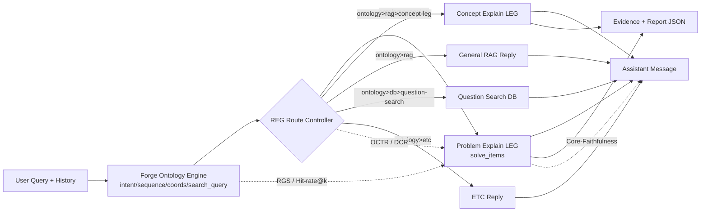

# Forge 서비스 워크플로우 다이어그램 작성 가이드 (코드 기준)

이 문서는 Diagrams 앱으로 논문용 시스템 구성도를 그릴 때, 현재 코드에 맞는 노드/경로/지표를 그대로 반영하기 위한 실전 가이드입니다.

## 1) 코드 기준 핵심 흐름

아래 파일이 실제 동작 기준입니다.

- API 엔트리/분기: [python_api/app/main.py](python_api/app/main.py#L895)
- 온톨로지 분석기: [python_api/app/rag/ontology_engine.py](python_api/app/rag/ontology_engine.py#L43)
- LEG/RAG 해설 생성 엔진: [python_api/app/rag/engine.py](python_api/app/rag/engine.py#L510)
- C그룹(Full Pipeline) 실험 파이프라인: [performance_comparison/full_pipeline.py](performance_comparison/full_pipeline.py#L1)
- 평가 지표 계산: [performance_comparison/evaluation.py](performance_comparison/evaluation.py#L340)
- 논문 지표 정의 문서: [performance_comparison/results/metric_framework_report.md](performance_comparison/results/metric_framework_report.md#L1)

## 2) Diagrams 초기 캔버스 설정 (논문 최적화)

1. Grid 끄기: View > Hide Grid
2. 배경: White
3. Palette 3색 고정
- White: 입력/검색/출력 노드
- Orange: 제어 핵심 (Ontology + REG)
- Black: 생성/평가 모듈
4. 폰트 통일
- SF Pro 또는 Arial
- 본문 11~12pt, 노드 라벨 12pt, 지표 10~11pt
5. 노드 크기 고정
- 가로 210~240, 세로 72~90 정도로 동일화

## 3) 노드 레이아웃 (코드 반영 버전)

### A. 온라인 서비스 추론 경로 (주 다이어그램)

#### Layer 1: Input (White)
- User Query
- Conversation History

#### Layer 2: Ontology + Control (Orange)
- Forge Ontology Engine
  - intent
  - intent_sequence
  - coordinate(s)
  - search_query
- REG/Route Controller (main.py 내부 분기)

코드상 주요 분기 라벨 (route 문자열 그대로 사용):
- ontology>etc
- ontology>rag>leg
- ontology>rag>concept-leg
- ontology>rag
- ontology>db>question-search
- ontology>rag>leg+db>question-search
- ontology>rag>concept-leg+db>question-search

#### Layer 3: Retrieval + Generation (Black)
- Chroma Retriever (similarity_search_with_relevance_scores)
- Context Budgeting / Table Fix
- Problem Explain LEG Generator (JSON)
- Concept Explain LEG Generator (JSON)

#### Layer 4: Output (White)
- Assistant Message
- LEG Report (overview/analysis/correction/insight/answer)
- Evidence List
- Recommended Questions (조건부)

### B. 오프라인 실험 경로 (보조 다이어그램)

#### Pipeline
- Dataset (120 questions)
- Ontology Analyze API 호출
- Full Pipeline 실행
- Raw JSONL + CSV 저장
- Judge/Evaluation
- Metrics Report

실험 코드 기준 컬럼/지표:
- is_correct
- format_score
- evidence_coverage
- latency_sec
- core faithfulness 계열 (평가 단계)

## 4) Edge 라벨에 지표 얹는 방법 (논문형)

선 위 텍스트를 다음처럼 넣으면 됩니다.

1. Ontology -> Retriever
- RGS
- Hit-rate@k

2. REG/Route -> Generator
- OCTR
- DCR

3. Generator -> Final Output
- Core-Faithfulness
- HallucinationRate = 1 - CoreFaithfulness

4. Runtime 성능 보조
- latency_sec

참고: 실험 CSV의 format_score/evidence_coverage는 운영 지표 성격, 논문 본문은 RGS/OCTR/DCR/Core-Faithfulness 중심으로 매핑하면 설명력이 좋습니다.

## 5) 권장 도형 규칙 (n8n 스타일 + 논문용)

1. 시작/종료: 둥근 사각형
2. 처리: 사각형
3. 라우팅 분기(REG): 다이아몬드 또는 Switch 스타일
4. 저장소(DB/Vector): 실린더
5. 노드 간 간격
- 가로 56~72
- 세로 44~56
6. 선 스타일
- 기본 1.5pt
- 핵심 경로(주장 경로): 2.25pt

## 6) 바로 그릴 수 있는 텍스트 청사진

아래 구조를 그대로 캔버스에 배치하세요.

1. User Query
2. Forge Ontology Engine
3. REG Route Controller
4. Branch A: Problem Explain LEG
5. Branch B: Concept Explain LEG
6. Branch C: General RAG
7. Optional Branch: Question Search DB
8. Final Assistant Message
9. Evidence + Report Blocks
10. Metrics Overlay (RGS, OCTR, DCR, Core-Faithfulness)

## 7) Mermaid 초안 (도식 초벌용)

## 8) Export (논문 삽입용)

1. File > Export
2. SVG 1순위, PDF 2순위
3. 선 두께와 폰트 깨짐 없는지 200% 확대 확인
4. 캡션 예시
- Figure X. Ontology-REG-RAG Integrated Workflow of Forge

## 9) 최종 체크리스트

- 코드 route 문자열과 도식 라벨이 일치하는가
- Orange 노드가 "통제 기여"를 명확히 보여주는가
- 지표가 선(Edge) 위에 배치되었는가
- LEG/Concept/RAG/DB 경로가 분리되어 보이는가
- SVG/PDF 확대 시 가독성이 유지되는가

---

원하면 다음 단계로, 이 문서를 기반으로 "논문 본문에 그대로 붙일 수 있는 Figure 설명문(국문/영문)"까지 같이 만들어드릴 수 있습니다.
