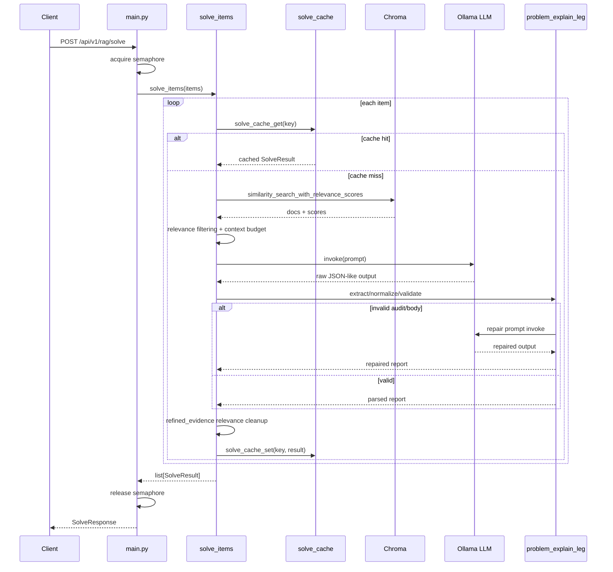
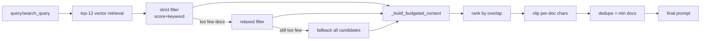
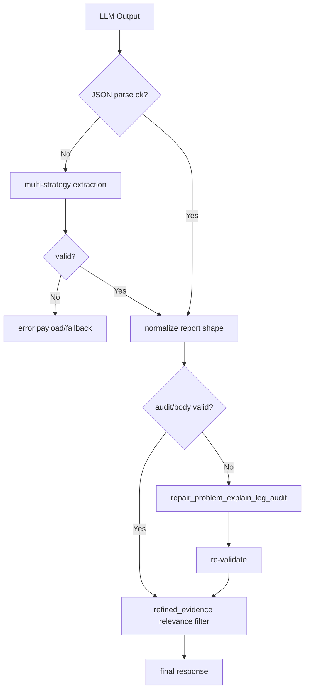

# Python API Pipeline Diagrams and Commentary

## 1. High-Level Component Diagram

```mermaid
flowchart LR
  Client[Client / Node Service] --> API[FastAPI main.py]
  API --> ORCH[Ontology Orchestrator\nforge_analyze]
  API --> SOLVE[/api/v1/rag/solve]

  ORCH --> INTENT[ForgeOntologyEngine]
  INTENT -->|EXPLAIN_PROBLEM| ENGINE[solve_items\nengine.py]
  INTENT -->|CONCEPT_EXPLAIN| CONCEPT[concept_explain_leg.py]
  INTENT -->|QUESTION_SEARCH| DBQ[PostgreSQL Query Path]
  INTENT -->|ETC| ETC[etc_reply.py]

  SOLVE --> ENGINE

  ENGINE --> CACHE[solve_cache.py\nLRU + Disk]
  ENGINE --> CHROMA[chroma_store.py\nChroma Vector DB]
  ENGINE --> OLLAMA[Ollama\nLLM + Embeddings]
  ENGINE --> LEG[problem_explain_leg.py\nJSON parse/normalize/repair]

  LEG --> RESP[SolveResult / JSON Response]
  CONCEPT --> RESP
  DBQ --> RESP
  ETC --> RESP
```

설명:
- main.py는 단순 라우터가 아니라 오케스트레이터 역할을 수행한다.
- solve_items가 실행 엔진의 중심이며, cache/chroma/llm/repair를 모두 관장한다.
- ontology 경로는 제어면(control plane), solve 경로는 실행면(data plane) 성격이 강하다.

---

## 2. /api/v1/rag/solve Sequence Diagram



설명:
- 생성 실패를 예외로 끝내지 않고 repair 루프로 회복하는 구조가 핵심이다.
- 캐시가 파이프라인 비용을 크게 낮추는 지점이다.

---

## 3. /api/v1/forge/analyze Routing Diagram

```mermaid
flowchart TD
  A[POST /api/v1/forge/analyze] --> B[Context augmentation\nconversation_context.py]
  B --> C[ForgeOntologyEngine.analyze]
  C --> D{intent}

  D -->|EXPLAIN_PROBLEM| E[MCQ parse\nmcq_payload.py]
  E --> F[solve_items]
  F --> R[Response + leg + route]

  D -->|CONCEPT_EXPLAIN| G[build_concept_explain_leg_reply]
  G --> R

  D -->|QUESTION_SEARCH| H[_find_related_questions]
  H --> R

  D -->|ETC| I[build_etc_reply]
  I --> R

  D -->|MOCK_EXAM_ANALYZE| J[main.py (mock exam helper block)]
  J --> R
```

설명:
- 이 경로의 본질은 "생성"이 아니라 "라우팅"이다.
- intent 품질이 전체 응답 품질의 상한을 결정한다.

---

## 4. Retrieval and Context Construction Diagram



설명:
- 이 단계는 recall 안정화에 강점이 있다.
- 다만 semantic reranking 부재로 정밀도 상한이 제한될 수 있다.

---

## 5. Reliability Guardrails Diagram



설명:
- 이 가드레일이 없으면 실서비스에서 파싱 오류와 근거 무결성 붕괴가 빈번해진다.

---

## 6. Performance/Scalability Interpretation

- 현재 구조는 안정성 우선이다.
- semaphore + sqlite-aware 운영은 장애 확률을 낮추는 대신 처리량 상한을 만든다.
- scale-out 시 핵심은 다음 세 가지다.
  - cache hit 최적화
  - reranking 효율화
  - 저장계층 락 민감도 완화

---

## 7. Suggested Future Diagram Extensions

1. Intent confidence + route fallback state machine diagram
2. KPI telemetry pipeline diagram (logs -> metrics -> alerts)
3. A/B deploy diagram for reranker experiments
